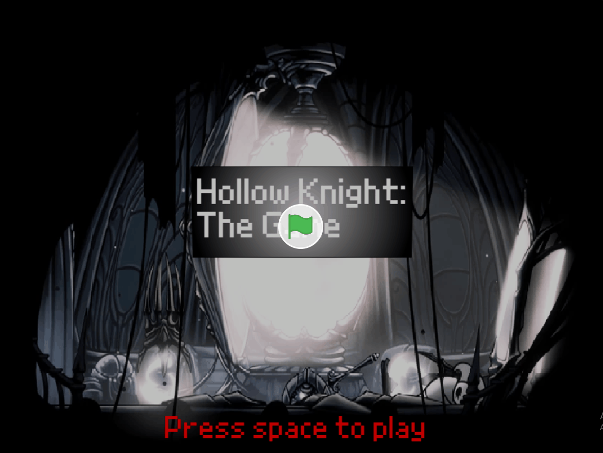

# CS50x - Week 0: Scratch Project 🎮

Este é o meu primeiro projeto para o curso CS50 de Harvard! 

## 🕹️ Como Jogar
* **Setas (Esq/Dir):** Movimentam o personagem.
* **Clique esquerdo do Mouse:** Ataca.

## 📺 Demonstração

---
*Developed as part of the CS50x 2026 curriculum.*
